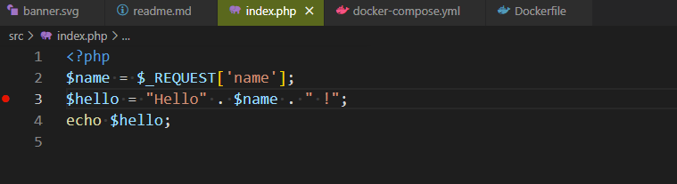
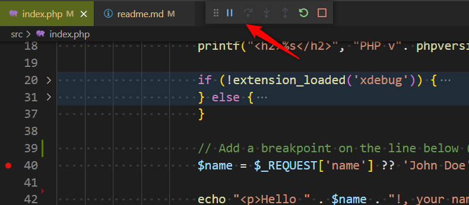
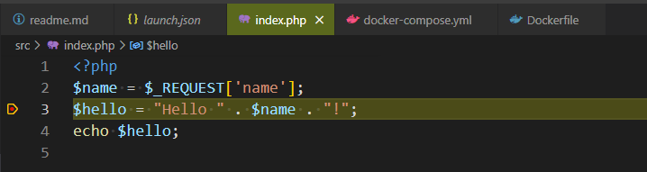

# Docker - Set up your vscode environment with xDebug

## Build the container

* Make sure [Docker](https://www.docker.com/products/docker-desktop) is installed,
* Make sure you've installed the [PHP Debug](https://marketplace.visualstudio.com/items?itemName=felixfbecker.php-debug) vscode addon of **Felix Becker**,
* Clone this repo on your computer (f.i. in the `~/repositories/` folder),
* Start a command prompt session and go inside the folder of this project (`cd ~/repositories/docker_xdebug`),
* Run the `docker-compose up --build -d` (Windows) or use the Bash script `./docker-up.sh` to build the container,
* Wait until the container is successfully built,
* Open a browser and surf to `http://localhost:8080/index.php?name=John Doe` and you must see *Hello John Doe!*,

## Start the debug session

* Open Visual Studio Code and open the project (in the command prompt, just run `code .`),
* Open the `src/index.php` file,
* Put a breakpoint on a line (select the line and press <kbd>F9</kbd>)

  

* Press <kbd>F5</kbd> to start a new debug session,
* If vscode ask for a configuration, select `Listen for XDebug`. You'll see the debug toolbar and the color of the vscode statusbar will change to orange (default color)

  

* Go back to your browser and refresh the page, vscode will immediately suspend the execution and will show this:

  

At the left side of the editor, click on the *Debug* icon (or press <kbd>CTRL</kbd>+<kbd>SHIFT</kbd>+<kbd>D</kbd>) and you'll have now access to the variables.

Open the `Debug console` (press <kbd>CTRL</kbd>+<kbd>SHIFT</kbd>+<kbd>Y</kbd>) and type `$name='Christophe'` so you'll replace the value.

Press <kbd>F5</kbd> to continue the script and see your browser. The displayed name has been updated to yours.

## How it works

You need a few files:

1. The `Dockerfile` contains a few statements to install the `xdebug` extension and to create a `xdebug.ini` file that will be used by Docker during the set-up of the container.
2. The `.vscode/launch.json` is used by Visual Studio Code and need to specify 
   1. which port to listen; that port has to be exactly the same of the one defined in the `.docker/php/conf.d/xdebug_v99.ini` file,
   2. which host to listen. The `hostname` should be set to `0.0.0.0`. In the `.docker/php/conf.d/xdebug_v99.ini` files, you should set `xdebug.client_host='host.docker.internal'`,
   3. the `pathMappings` variable should translate the filepath from the Docker container (like `/var/www/html`) to the structure in your project (like `${workspaceRoot}/src`. Visual Studio Code needs to be able to know which file on your host is associated to the file in the container.
3. The `docker-compose.yml` contains instruction on how to build the Docker container (for a production environment) and the `docker-compose.override.yml.dev` file contains information's required during the development phase. During your development, you'll need to make a copy of `docker-compose.override.yml.dev`. That `docker-compose.override.yml` (once created) will instruct Docker to synchronize your files between the host and the Docker environment; you can change your local files and the changes will be immediately done in Docker too.
4. `docker-down.sh` and `docker-up.sh` are two smalls utilities for Linux (or to run under WSL2); not mandatory but useful when you need to shutdown the Docker containers and rebuild them.
