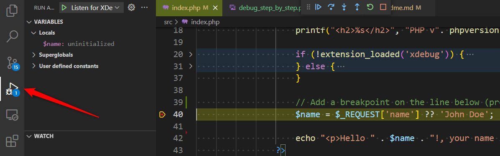

# Docker - Set up your vscode environment with xDebug

The objective of this repository is to provide the minimum requirements for launching a PHP project that will run:

* Under Docker,
* With tow images: one for PHP and one for Apache,
* Install Xdebug and enable it in the PHP image,
* Foresee configuration's variables for enabling a development mode.

By default, Xdebug won't be installed. You'll need to enable it.

First, clone this repository on your computer, let's say in the `~/repositories/` folder. You'll then get a  `~/repositories/docker_xdebug` directory once the git clone is successful. 

## Use the application without Xdebug

1. Make sure [Docker](https://www.docker.com/products/docker-desktop) is installed on your computer and WSL2 is enabled in the configuration screen of Docker desktop,
2. Start a console and go inside the folder of this project (`cd ~/repositories/docker_xdebug`),
3. Under Linux / WSL2, run `./docker-up.sh` to build the images and (`./docker-down.sh` to remove them) or, under Windows, run the `docker-compose up --build -d` to do the same,
4. You'll be asked, the first time, to create the `.env` file so just do as required i.e. please run `cp .env.example .env` (Linux) or `copy .env.example .env` (Windows). Don't make changes to the `.env` right now. Restart the step 3.
5. Wait until the container is successfully built,

    

6. Open a browser and surf to `http://localhost:8080/index.php`

If everything is correctly build, you'll get the page below, just saying XDebug is not installed. Let's call this environment the production one: you've successfully executed the PHP script inside Docker.

## Restart the application with Xdebug enabled

Now, let's activate the development/debugging environment i.e. the one with Xdebug installed and changes you'll made to your codebase will be reflected to the Docker images directly.

1. Edit the `.env` file you've created earlier and initialize the `XDEBUG_INSTALL` to `true`,
2. Also make a copy of the `docker-compose.override.yml.dev` by running `cp docker-compose.override.yml.dev docker-compose.override.yml` (Linux) or `copy docker-compose.override.yml.dev docker-compose.override.yml` (Windows)
3. Run `./docker-down.sh ; ./docker-up.sh` to remove the previous images and create new ones,
4. Go back to your browser and refresh the same page and you should get a green block:

If you don't have that one, make sure you've correctly updated the `.env` file as explained earlier. 

## Start a debugging session

1. Open Visual Studio Code and open the project (in a console, just run `code .` to do this),
2. Make sure you've installed the [PHP Debug](https://marketplace.visualstudio.com/items?itemName=felixfbecker.php-debug) vscode addon of **Felix Becker** (note: you don't need to have that extension if you'll work remotely, see below),
3. Open the `src/index.php` file,
4. Navigate and add a breakpoint one the line with the `$name = $_REQUEST['name'] ...` (click somewhere on that line and press <kbd>F9</kbd>. you'll see a red bullet in the left margin like illustrated below)

  

5. Now, press <kbd>F5</kbd> to start a new debug session inside vscode. If vscode ask for a configuration, select `Listen for XDebug`. You'll see the debug toolbar and the color of the vscode statusbar will change to orange (default color)

  

6. Go back to your browser and refresh the page, vscode will immediately suspend the execution and will show this screen:

  

The execution has been suspended on the highlighted line. Just press <kbd>F5</kbd> in vscode to continue the execution of the script (and go to the next breakpoint if there is one).

### Work remotely, in the container

You can start Visual Code and work locally (on your host) or remotely (directly inside the Docker image). Working remotely will give you a better debugging experience since, remotely also means that you'll have access to the `~/vendor` folder f.i.

Working remotely will also use the definition of the `devcontainer.json` file to correctly configure vscode. 

Concretely: in vscode, press <kbd>CTRL</kbd>-<kbd>P</kbd> to get access to the command palette and select `Remote-Containers: Reopen in Container`.

### Show the debug pane and play with a variable

At the left side of the editor, click on the *Debug* icon (or press <kbd>CTRL</kbd>+<kbd>SHIFT</kbd>+<kbd>D</kbd>) and you'll have now access to the variables.

Let's try something: in vscode start a Debug session as seen above, suspend the code on your breakpoint.

Now press <kbd>F10</kbd>: you'll run the current sentence and vscode will jump to the next one. This is the step-by-step execution of your code.

So, now that we've assigned a value to the `$name` variable; we'll just change it.

Open the `Debug console` (press <kbd>CTRL</kbd>+<kbd>SHIFT</kbd>+<kbd>Y</kbd>) and type `$name='Christophe'` so you'll replace the value and press <kbd>Enter</kbd>.

You've updated the value of the `$name` variable.

Still in vscode, press <kbd>F5</kbd> to continue the script and pay attention to your browser. The displayed name has been updated to yours.

## How it works

You need a few files:

1. The `.docker/php/Dockerfile` contains a few statements to install the `Xdebug` extension when the `XDEBUG_INSTALL` argument is set to `true`. This is why 1. we need to update our `.env` file and 2. we need to create the `docker-compose.override.yml` file to use that variable. 
2. The `.docker/php/conf.d/xdebug_v3.ini` (or `v2`) file contains instruction to correctly configure Xdebug with Docker. The variable `xdebug.client_port` is really important since we need to set which port to use and, for the same reason, we need to set the `xdebug.client_host` variable. Here, don't change the value, keep `host.docker.internal`.
3. The `.vscode/launch.json` is used by Visual Studio Code to know how a debugging session should be configured:
   1. which port to listen; that port has to be exactly the same of the one defined in the `.docker/php/conf.d/xdebug_v3.ini` file,
   2. which host to listen. The `hostname` should be set to `localhost`. In the `.docker/php/conf.d/xdebug_v3.ini` files, you should set `xdebug.client_host='host.docker.internal'`,
   3. the `pathMappings` variable should translate the filepath from the Docker container (like `/var/www/html`) to the structure in your project (like `${workspaceRoot}/src`. Visual Studio Code needs to be able to know which file on your host is associated to the file in the container.
3. The `docker-compose.yml` contains instruction on how to build the Docker container (for a production environment) and the `docker-compose.override.yml.dev` file contains information's required during the development phase. During your development, you'll need to make a copy of `docker-compose.override.yml.dev`. That `docker-compose.override.yml` (once created) will instruct Docker to synchronize your files between the host and the Docker environment; you can change your local files and the changes will be immediately done in Docker too.
4. `docker-down.sh` and `docker-up.sh` are two smalls utilities for Linux (or to run under WSL2); not mandatory but useful when you need to shutdown the Docker containers and rebuild them.
